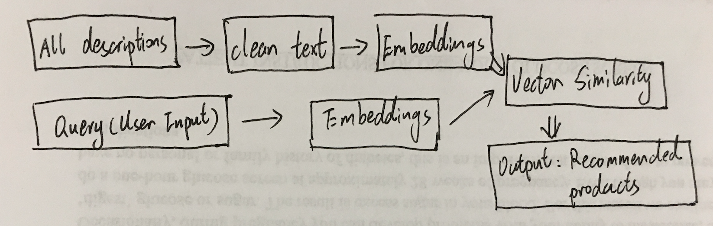

# NLP_Recommendation

#### Determining challenges to tackle
The vast amount of information available has led to an overwhelming number of choices for users. As a result, recommendation systems have become essential tools for developers to help users discover relevant products or content. Traditional methods often relied on keywords filtering or content-based filtering, but advancements in Natural Language Processing (NLP) and transformer models have opened up new possibilities for building more sophisticated and context-aware recommendation systems.

#### Key Objectives
* Semantic Understanding: Utilize NLP models to extract meaningful semantic information from both user input and product descriptions.

* Context-Aware Recommendations: Build a recommendation system that understands the context and preferences with providing more accurate and context-aware suggestions.

* Scalability: Design the system to be scalable, allowing for efficient handling of large datasets and a growing number of products.

#### Technical Framework
* Step 1: Using embedding, map all descriptions to a low-dimensional vector space, obtaining "description vectors."

* Step 2: Same to embedding query (user input)

* Step 3: Compare the similarity (vector similarity) using cosine similarity score between the Query and each description vectors, retrieving a set of the most similar descriptions.

* Step 4: return the list of recommended products

